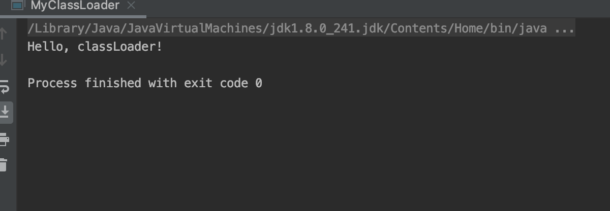

结果:




实现代码:


<br>

源码: [点击打开代码](https://github.com/Tureen/grow/tree/main/1_JVM/src/main/java/club/tulane/jvm/work/MyClassLoader.java)

```java
package club.tulane.jvm.work;

import java.io.FileInputStream;
import java.io.IOException;
import java.lang.reflect.Method;

public class MyClassLoader extends ClassLoader {

    public static void main(String[] args) {
        try {
            final Class<?> hello = new MyClassLoader().findClass("Hello");
            final Object helloObj = hello.newInstance();
            final Method helloMethod = hello.getMethod("hello");
            helloMethod.invoke(helloObj);
        } catch (Exception e) {
            e.printStackTrace();
        }
    }

    @Override
    protected Class<?> findClass(String name) {
        final byte[] fromFile = getFromFile();
        final byte[] bytes = reverseBytes(fromFile);
        return defineClass(name, bytes, 0, bytes.length);
    }

    private byte[] getFromFile() {
        byte[] bytes = null;
        String destFile = "/Users/Tulane/学习笔记/java进阶/1.字节码_内存模型/Hello/Hello.xlass";
        try (FileInputStream fis   = new FileInputStream(destFile)){
            bytes = new byte[fis.available()];
            fis.read(bytes);
        } catch (IOException e) {
            e.printStackTrace();
        }
        return bytes;
    }

    private byte[] reverseBytes(byte[] bytes){
        byte[] rBytes = new byte[bytes.length];
        for (int i = 0; i < bytes.length; i++) {
            rBytes[i] = (byte) (255 - bytes[i]);
        }
        return rBytes;
    }
}

```