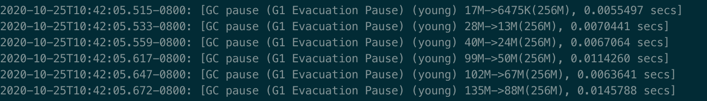

# GC 分析

1. 串行GC 性能分析
2. 并行GC 性能分析
3. 并发GC 性能分析
4. G1 GC 性能分析

## 串行 GC

**预期**: 串行 GC 使用单线程, 对资源利用率不够

*-Xms256m -Xmx256m* 

| GC类型   | 容量(MB) | 耗时(ms) |
| -------- | -------- | -------- |
| Young GC | 76.8     | 14       |
| Young GC | 76.8     | 29       |
| Young GC | 76.8     | 22       |
| ...      | ...      | ...      |
| Full GC  | 170      | 43       |
| Full GC  | 170      | 36       |
| Full GC  | 170      | 39       |

分析: 

1. 限制了堆最大为256m, 年轻代与老年代比率默认为1:2, 所以老年代的最大值为170m左右, 不会继续升高.

2. 在170MB左右的容量回收时, 串行GC的平均耗时为40ms左右, 延时太大.

## 并行GC

**预期**: 并行GC 使用多线程, 对资源利用率高, 延时低

*-Xms256m -Xmx256m* 

| GC类型   | 容量(MB) | 耗时(ms) |
| -------- | -------- | -------- |
| Young GC | 74.5     | 8        |
| Young GC | 74.5     | 18       |
| Young GC | 74.5     | 16       |
| ...      |          |          |
| Full GC  | 171      | 37       |
| Full GC  | 171      | 41       |
| Full GC  | 171      | 33       |

**分析**:

1. Young GC在同等容量下, 相对于串行GC的耗时有明显下降
2. **Full GC在同等容量下比之串行GC没有大的变化**

**疑问**: Full GC的性能增幅不明显

1. **是否是因为 串行GC 在FullGC时, 仅会回收老年代区域, 而 并行GC 则会回收年轻代与老年代?  **

   * 在图中可以看出, 串行GC在 YoungGC 时回收的区域是 DefNew, 而在 Full GC 时回收的区域是 Tenured? 

   * 但看回收总量, Tenured没有明显下降, 但总量却有下降, 这是因为其实还是顺带回收了年轻代么?  ( **望助教老师能解答一二** )

     

2. 还有的可能是其他进程, 影响了CPU核心占用数, 导致并行GC时没有获得足够资源.

## 并发GC

**预期**: 将GC的处理步骤分离, 其中stop the world 时间变短, 延迟降低

*-Xms256m -Xmx256m* 

| GC类型   | 容量(MB) | 耗时(ms)   |
| -------- | -------- | ---------- |
| Young GC | 76.8     | 11         |
| Young GC | 76.8     | 20         |
| Young GC | 76.8     | 19         |
| ...      |          |            |
| Full GC  | 170.6    | 0.2 + 2    |
| Full GC  | 170.6    | 0.16 + 1.1 |
| Full GC  | 170.6    | 0.18 + 1.1 |

**分析**:

1. 由于 CMS 是老年代收集器, Young GC 仍然使用并行 GC, 所以 Young GC 的表现与并行GC一致.
2. Full GC时延迟减低降低了一个数量级, 降低幅度明细

**疑问:** CMS 的 Full GC中, 延时时间如何计算?

1. 我的计算方式是, 累加 *CMS Inital Mark* 与 *CMS Final Remark* 两个阶段的延时时间, 因为只有这两个阶段需要 STW, 其他阶段皆为并发阶段, 不影响业务处理, 此方式是否正确?

2. 在 *CMS Final Remark* 的延时时间计算上, 不明白是累加计算所有看到的毫秒, 还是只需要看最后一个时间? ( **望助教老师能解答一二** )

   

# G1GC

G1GC分为几个阶段: 

1. Evacuation Pause(young)纯年轻代模式转移暂停
2. 与CMS类型的并发回收
3. Evacuation Pause(mixed)混合模式
4. Full GC

*-Xms256m -Xmx256m* 

**分析:**

* young阶段的每次回收容量不规律, 因为它是优先选择回收的GC模式, 但看的出, 在回收135M空间时, 仅需 14ms

  

* 而在并发回收时, 累加初始标记和再次标记的时间, 所需延时也不到10ms

  

* **混合模式下的回收效率也非常高**, 160-180M容量的延迟, 也需要2.5ms左右

  

* FullGC 性能有高有低, 当延迟很高时, 是因为触发了G1GC的退化机制, 会使用 串行GC收集, 导致延时大大增加

  *高延迟: 30~50ms*

  

  

  *低延迟: 10ms以下*

  

  
