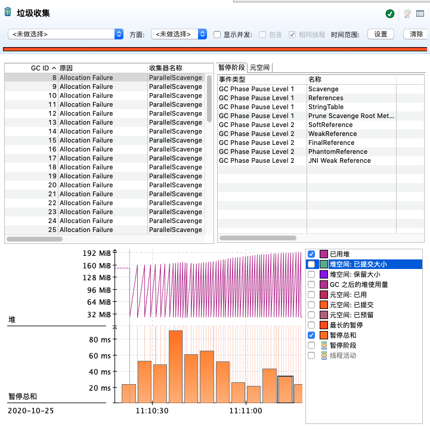

# 压测 (wrk)


## 第一次测试

*启动程序: -Xms512m -Xmx512m*


*使用命令:* 

```shell
# -t为线程 -c为并发, -d为持续时间
wrk -t8 -c40 -d60s http://localhost:8088/api/hello
```


### wrk结果

**注: 本次测试开了JMC飞行记录器**


* QPS(sec): 5793.59

* 平均响应时间: 19.10ms

* 最大响应时间: 706.87ms


**再来看下响应时间分布**: *加参数 --latency*


* 90响应时间: 6.01ms

* 99响应时间: 80.21ms

* QPS(sec): 17788.49 (这次没开飞行记录器, QPS提高了接近两倍)


### JMC飞行记录器




问题: GC过于频繁, GC暂停时间太长, 达到80ms以上


## 第二次测试

*启动程序: -Xms512m -Xmx512m*


*使用命令:* 

```shell
wrk -t8 -c40 -d60s http://localhost:8088/api/hello
```


### wrk结果

**注: 本次测试开了JMC飞行记录器**


* QPS(sec): 7413.40 (上升明显)

* 平均响应时间: 13.74ms (响应速度更快)

* 最大响应时间: 643.15ms (最大响应时间降低)


### JMC飞行记录器


现象: GC次数明显降低, 暂停总和也降低了几倍

结论: 通过将堆内存从512M调大到2g, GC的次数降低, GC延迟下降, QPS上升且用户响应时间明显缩短